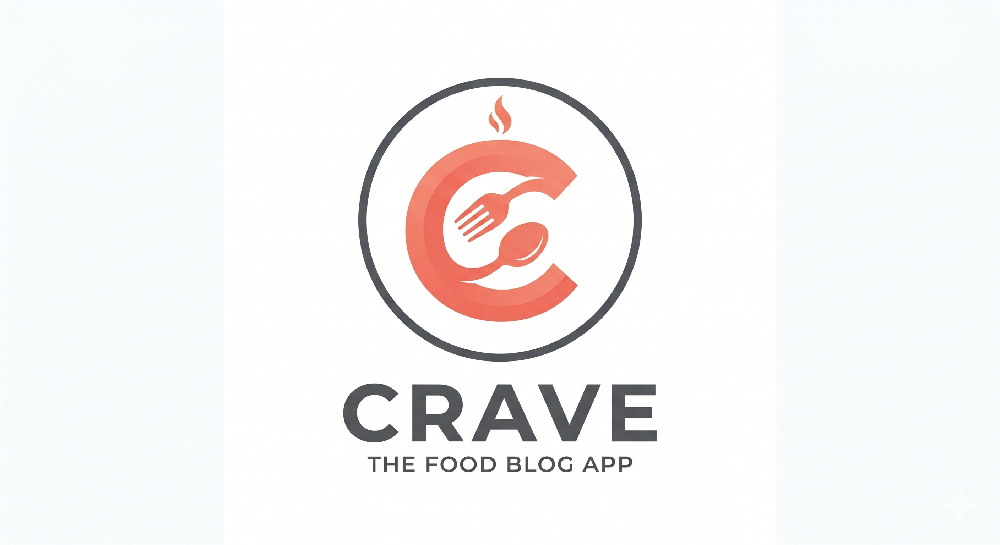

<p align="center">
  
</p>

<h1 align="center">Crave — The Food Blog App</h1>

<p align="center">
  A full-stack recipe sharing platform where food lovers can discover, create, and save recipes from home chefs around the world.
</p>

<p align="center">
  
  
  
  
  
</p>

---

## Table of Contents

- [Features](#features)
- [Architecture](#architecture)
- [Tech Stack](#tech-stack)
- [Project Structure](#project-structure)
- [Getting Started](#getting-started)
  - [Prerequisites](#prerequisites)
  - [Running Locally](#running-locally)
  - [Seed Data](#seed-data)
- [API Reference](#api-reference)
- [Authentication Flow](#authentication-flow)
- [Deployment](#deployment)
- [Environment Variables](#environment-variables)
- [Default Accounts](#default-accounts)

---

## Features

### Public
- 🏠 **Home Page** — Browse all recipes with a hero search bar and animated UI
- 🔍 **Search & Filter** — Real-time debounced search by title, filter by category (Breakfast, Lunch, Dinner, Dessert, Snack)
- 📄 **Recipe Details** — Full recipe view with ingredients, step-by-step instructions, cooking time, and creator info
- 📖 **Pagination** — "Load More" infinite-scroll style pagination
- 👤 **User Profiles** — View public profiles of creators, their follower counts, and their created recipes
- 📤 **Native Sharing** — Share recipes easily via the Web Share API (`navigator.share`)

### Authenticated Users
- ✍️ **Create Recipes** — Rich form with live image preview, dynamic ingredient fields, and category selection
- ❤️ **Favorites** — Toggle favorite on any recipe, view all saved favorites on your dashboard
- ⭐ **Ratings & Reviews** — Rate recipes (1-5 stars) and leave comments to help the community
- 👥 **Follow System** — Follow and unfollow your favorite recipe creators
- 📊 **Dashboard** — Personal profile showing your created recipes, favorites, followers/following counts, and account info
- 🗑️ **Delete Own Recipes** — Remove recipes you've created

### Admin
- 🛡️ **Admin Dashboard** — View and manage all recipes and users on the platform
- 👥 **User Management** — View all registered users and delete accounts (with cascade)
- 🍽️ **Recipe Moderation** — Delete any recipe on the platform

### UI/UX
- 🌙 **Dark Mode** — Full dark/light theme toggle with system persistence
- 💎 **Glassmorphism Design** — Modern translucent card UI with backdrop blur
- 📱 **Fully Responsive** — Mobile-first design with hamburger menu navigation
- ✨ **Micro-animations** — Hover effects, scale transforms, and smooth transitions

### Smart Features (Phase 3)
- 🥕 **Pantry Search** — Reverse ingredient search to find recipes based on what you have in your fridge
- ⚖️ **Yield Scaling** — Dynamically scale recipe ingredient quantities by adjusting the serving size
- 📊 **Nutritional Facts** — Automatic macro-nutrient calculation (Calories, Protein, Carbs, Fats) for recipes

---

## Architecture

```
┌─────────────────┐         HTTP/JSON          ┌──────────────────────┐
│                 │  ◄──────────────────────►   │                      │
│   React SPA     │     (Axios + JWT)           │   Spring Boot API    │
│   (Vite)        │                             │                      │
│                 │                             │  ┌────────────────┐  │
│  ┌───────────┐  │                             │  │  Controllers   │  │
│  │  Pages    │  │                             │  │  (REST)        │  │
│  │  ├ Home   │  │                             │  └───────┬────────┘  │
│  │  ├ Login  │  │                             │          │           │
│  │  ├ Dash   │  │                             │  ┌───────▼────────┐  │
│  │  └ Admin  │  │                             │  │  Services      │  │
│  ├───────────┤  │                             │  │  (Business)    │  │
│  │Components │  │                             │  └───────┬────────┘  │
│  │  ├ Navbar │  │                             │          │           │
│  │  └ Cards  │  │                             │  ┌───────▼────────┐  │
│  ├───────────┤  │                             │  │  Repositories  │  │
│  │ Context   │  │                             │  │  (JPA)         │  │
│  │  ├ Auth   │  │                             │  └───────┬────────┘  │
│  │  └ Theme  │  │                             │          │           │
│  └───────────┘  │                             └──────────┼───────────┘
│                 │                                        │
│  Vercel         │                              ┌─────────▼─────────┐
│  (Frontend)     │                              │   PostgreSQL      │
└─────────────────┘                              │   (Production)    │
                                                 │   H2 (Local Dev)  │
                                                 └───────────────────┘
```

**Key architectural decisions:**

| Decision | Rationale |
|----------|-----------|
| **JWT in LocalStorage** | Stateless auth — no server-side sessions needed. Token attached via Axios interceptor. |
| **Spring Profiles** | `local` profile uses H2 in-memory DB (zero setup); `prod` uses PostgreSQL via env vars. |
| **Paginated API** | Spring Data `Page<T>` for efficient large dataset handling with `last` flag for client-side "Load More". |
| **Role-based access** | `USER` and `ADMIN` roles enforced at both Security filter level and `@PreAuthorize`. |
| **CORS wildcard** | Allows any origin — suitable for Vercel preview URLs. Tighten for production. |

---

## Tech Stack

### Frontend

| Technology | Version | Purpose |
|-----------|---------|---------|
| React | 19 | UI library |
| Vite | 8 | Build tool & dev server |
| Tailwind CSS | 4 | Utility-first styling |
| React Router | 7 | Client-side routing |
| Axios | 1.15 | HTTP client |
| React Hot Toast | 2.6 | Toast notifications |

### Backend

| Technology | Version | Purpose |
|-----------|---------|---------|
| Spring Boot | 3.2.4 | Application framework |
| Java | 17 | Language runtime |
| Spring Security | 6.x | Authentication & authorization |
| Spring Data JPA | 3.x | Database ORM |
| JJWT | 0.11.5 | JWT token generation & validation |
| PostgreSQL | 15+ | Production database |
| H2 | 2.x | Local development database |
| Lombok | — | Boilerplate reduction |

---

## Project Structure

```
Crave-FoodBlog/
├── backend/
│   ├── Dockerfile
│   ├── pom.xml
│   └── src/main/
│       ├── java/com/foodblog/
│       │   ├── FoodBlogApplication.java        # Entry point
│       │   ├── config/
│       │   │   ├── DataInitializer.java         # Creates default admin user
│       │   │   └── DataSeeder.java              # Seeds sample data (14 recipes, 3 users)
│       │   ├── controller/
│       │   │   ├── AuthController.java          # POST /api/auth/login, /register
│       │   │   ├── RecipeController.java        # CRUD /api/recipes
│       │   │   ├── UserController.java          # GET /api/users/profile, POST favorites
│       │   │   └── AdminController.java         # GET/DELETE /api/admin/users
│       │   ├── dto/
│       │   │   ├── RecipeDto.java
│       │   │   ├── UserDto.java
│       │   │   ├── LoginDto.java
│       │   │   ├── RegisterDto.java
│       │   │   └── JwtResponseDto.java
│       │   ├── entity/
│       │   │   ├── User.java                    # Users table + favorites + viewed recipes
│       │   │   └── Recipe.java                  # Recipes table + ingredients collection
│       │   ├── enums/
│       │   │   └── Role.java                    # USER, ADMIN
│       │   ├── exception/
│       │   │   ├── ErrorDetails.java
│       │   │   ├── GlobalExceptionHandler.java
│       │   │   └── ResourceNotFoundException.java
│       │   ├── repository/
│       │   │   ├── RecipeRepository.java        # Custom query methods for search/filter
│       │   │   └── UserRepository.java
│       │   ├── security/
│       │   │   ├── SecurityConfig.java          # CORS, JWT filter chain, role-based access
│       │   │   ├── JwtTokenProvider.java        # Token generation & validation
│       │   │   ├── JwtAuthenticationFilter.java # Extracts JWT from requests
│       │   │   └── CustomUserDetailsService.java
│       │   └── service/
│       │       ├── AuthService.java             # Login & registration logic
│       │       ├── RecipeService.java           # CRUD + search + pagination
│       │       └── UserService.java             # Profile, favorites, admin operations
│       └── resources/
│           ├── application.properties           # Shared config (profile selection, JWT)
│           ├── application-local.properties     # H2 database config (dev)
│           └── application-prod.properties      # PostgreSQL config (production)
│
├── frontend/
│   ├── .env                                     # VITE_API_URL for local dev
│   ├── index.html
│   ├── package.json
│   ├── vite.config.js
│   ├── vercel.json                              # SPA rewrite rules for Vercel
│   └── src/
│       ├── main.jsx                             # App entry — BrowserRouter + AuthProvider
│       ├── App.jsx                              # Routes + ThemeProvider + Navbar
│       ├── index.css                            # Tailwind imports, CSS variables, glass utility
│       ├── App.css
│       ├── services/
│       │   └── api.js                           # Axios instance + JWT interceptor
│       ├── context/
│       │   ├── AuthContext.jsx                  # Auth state, login/register/logout
│       │   └── ThemeContext.jsx                 # Dark/light theme toggle
│       ├── components/
│       │   ├── Navbar.jsx                       # Responsive nav with mobile menu
│       │   ├── RecipeCard.jsx                   # Recipe preview card with hover effects
│       │   └── ProtectedRoute.jsx               # Auth guard with optional admin check
│       └── pages/
│           ├── Home.jsx                         # Hero, search, category filter, recipe grid
│           ├── Login.jsx                        # Login form
│           ├── Register.jsx                     # Registration form
│           ├── RecipeDetails.jsx                # Full recipe view + delete + favorite
│           ├── AddRecipe.jsx                    # Create recipe form with live preview
│           ├── Dashboard.jsx                    # User profile + created/favorited recipes
│           └── AdminDashboard.jsx               # Admin panel — manage users & recipes
│
├── logo.png
└── .gitignore
```

---

## Getting Started

### Prerequisites

| Tool | Version | Required For |
|------|---------|-------------|
| **Java JDK** | 17+ | Backend |
| **Maven** | 3.8+ | Backend build |
| **Node.js** | 18+ | Frontend |
| **npm** | 9+ | Frontend dependencies |

> **Note:** No database installation needed! The local profile uses H2 in-memory database.

### Running Locally

**1. Clone the repository**
```bash
git clone https://github.com/Nightwing-007/Crave-FoodBlog.git
cd Crave-FoodBlog
```

**2. Start the backend** (Terminal 1)
```bash
cd backend
mvn spring-boot:run
```
The API will be available at `http://localhost:8080`.

**3. Start the frontend** (Terminal 2)
```bash
cd frontend
npm install
npm run dev
```
The app will be available at `http://localhost:5173`.

**4. Open the app**

Navigate to [http://localhost:5173](http://localhost:5173) in your browser. The database is auto-seeded with sample data!

### Seed Data

On first run with the `local` profile, the app automatically seeds:

| Data | Count | Details |
|------|-------|---------|
| Admin User | 1 | `admin@foodblog.com` / `admin123` |
| Sample Users | 3 | Gordon, Julia, Jamie — all with password `password123` |
| Recipes | 14 | Spread across all 5 categories with images, ingredients, and instructions |
| Favorites | 10 | Cross-user favorites to populate dashboards |

The seeder is **idempotent** — it skips if data already exists. To re-seed, restart the app (H2 is in-memory, so data resets on restart).

To **disable** seeding, remove `foodblog.seed=true` from `application-local.properties`.

---

## API Reference

### Authentication

| Method | Endpoint | Body | Description |
|--------|----------|------|-------------|
| `POST` | `/api/auth/register` | `{ name, email, password }` | Register a new user |
| `POST` | `/api/auth/login` | `{ email, password }` | Login, returns JWT token |

### Recipes

| Method | Endpoint | Auth | Description |
|--------|----------|------|-------------|
| `GET` | `/api/recipes` | No | List recipes (paginated, filterable) |
| `GET` | `/api/recipes/pantry?ingredients=tomato,onion` | No | Find recipes containing specific ingredients |
| `GET` | `/api/recipes/:id` | No | Get recipe by ID |
| `POST` | `/api/recipes` | Yes | Create a new recipe |
| `DELETE` | `/api/recipes/:id` | Yes | Delete recipe (owner or admin only) |
| `GET` | `/api/recipes/:id/reviews` | No | List reviews for a recipe |
| `POST` | `/api/recipes/:id/reviews` | Yes | Add a rating and review to a recipe |

### Users

| Method | Endpoint | Auth | Description |
|--------|----------|------|-------------|
| `GET` | `/api/users/profile` | Yes | Get current user's profile with recipes & favorites |
| `GET` | `/api/users/:userId` | No | Get public user profile with follower counts |
| `POST` | `/api/users/:recipeId/favorite` | Yes | Toggle favorite on a recipe |
| `POST` | `/api/users/:userId/follow` | Yes | Toggle follow on a user |

### Admin

| Method | Endpoint | Auth | Description |
|--------|----------|------|-------------|
| `GET` | `/api/admin/users` | Admin | List all users |
| `DELETE` | `/api/admin/users/:id` | Admin | Delete a user and their recipes |

### Response Format

**Paginated response** (GET /api/recipes):
```json
{
  "content": [ { "id": 1, "title": "...", ... } ],
  "totalPages": 3,
  "totalElements": 14,
  "size": 6,
  "number": 0,
  "last": false
}
```

**JWT login response** (POST /api/auth/login):
```json
{
  "token": "eyJhbGciOiJIUzI1NiJ9...",
  "id": 1,
  "name": "System Admin",
  "email": "admin@foodblog.com",
  "role": "ADMIN"
}
```

**Error response:**
```json
{
  "timestamp": "2025-01-01T00:00:00.000+00:00",
  "message": "Recipe not found with id: 99",
  "details": "uri=/api/recipes/99"
}
```

---

## Authentication Flow

```
┌──────────┐     POST /api/auth/login      ┌──────────────┐
│  Client  │  ──────────────────────────►   │  AuthService  │
│          │     { email, password }         │              │
│          │                                │  ┌──────────┐│
│          │                                │  │ Verify   ││
│          │     { token, id, name, role }   │  │ Password ││
│          │  ◄──────────────────────────   │  └──────────┘│
│          │                                └──────────────┘
│          │
│  Store token in localStorage
│          │
│          │     GET /api/recipes (+ any protected route)
│          │  ──────────────────────────►   ┌──────────────┐
│          │     Authorization:              │  JWT Filter   │
│          │     Bearer eyJhbG...            │              │
│          │                                │  Validates    │
│          │     200 OK + data              │  token &      │
│          │  ◄──────────────────────────   │  sets auth    │
└──────────┘                                └──────────────┘
```

- Tokens expire after **24 hours** (`foodblog.jwt.expiration=86400000`)
- On 401 response, the Axios interceptor auto-clears the token and redirects to `/login`

---

## Deployment

### Frontend (Vercel)

1. Connect your GitHub repo to [Vercel](https://vercel.com)
2. Set the **Root Directory** to `frontend`
3. Set the **Build Command** to `npm run build`
4. Set the **Output Directory** to `dist`
5. Add environment variable: `VITE_API_URL` = your backend URL (e.g., `https://your-api.onrender.com/api`)
6. The `vercel.json` already handles SPA rewrites

### Backend (Docker — Render / Railway / Fly.io)

1. Point the build to the `backend/` directory
2. The `Dockerfile` handles everything (multi-stage build with production profile)
3. Set the required environment variables (see below)

```bash
# Build and run with Docker
cd backend
docker build -t crave-backend .
docker run -p 8080:8080 \
  -e DB_URL=jdbc:postgresql://host:5432/crave \
  -e DB_USERNAME=postgres \
  -e DB_PASSWORD=your_password \
  -e JWT_SECRET=your_secret_key \
  crave-backend
```

---

## Environment Variables

### Backend

| Variable | Required | Default | Description |
|----------|----------|---------|-------------|
| `SPRING_PROFILES_ACTIVE` | No | `local` | Set to `prod` for production |
| `PORT` | No | `8080` | Server port |
| `DB_URL` | Prod only | — | PostgreSQL JDBC URL |
| `DB_USERNAME` | Prod only | — | Database username |
| `DB_PASSWORD` | Prod only | — | Database password |
| `JWT_SECRET` | No | Built-in default | Base64-encoded signing key |
| `NUTRITION_API_KEY` | No | — | API key for third-party nutrition service (e.g., Spoonacular). Falls back to mock calculation if omitted. |

### Frontend

| Variable | Required | Default | Description |
|----------|----------|---------|-------------|
| `VITE_API_URL` | No | `http://localhost:8080/api` | Backend API base URL |

---

## Default Accounts

| Role | Email | Password |
|------|-------|----------|
| **Admin** | `admin@foodblog.com` | `admin123` |
| **User** | `gordon@crave.com` | `password123` |
| **User** | `julia@crave.com` | `password123` |
| **User** | `jamie@crave.com` | `password123` |

> The admin account is created by `DataInitializer` on every startup. Sample user accounts and recipes are created by `DataSeeder` when `foodblog.seed=true` (enabled by default in the `local` profile).

---

## Local Development Tools

### H2 Database Console

When running locally, you can inspect the database at:

**URL:** [http://localhost:8080/h2-console](http://localhost:8080/h2-console)

| Setting | Value |
|---------|-------|
| JDBC URL | `jdbc:h2:mem:foodblogdb` |
| Username | `sa` |
| Password | *(leave empty)* |

---

## License

This project is for educational and personal use.
